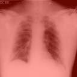

# 🩺 Deep Learning: COVID-19 Chest X-ray Classification with Grad-CAM

A complete deep learning project that classifies chest X-ray images as **COVID-19** or **Normal** using a **Convolutional Neural Network (CNN)** built with **TensorFlow/Keras**.  
Includes **Grad-CAM visualizations** to interpret model predictions and highlight critical lung regions.

---

## 🚀 Key Features
- End-to-end deep learning pipeline (data → training → evaluation)
- Grad-CAM for model explainability
- Reproducible notebooks with clear workflow
- Organized folder structure (ready for deployment or research)

---

## 🧠 Tech Stack


---

## 📂 Project Structure
```
covid19-xray-classification/
├── data/                 # train, test, validation sets
├── images/               # Grad-CAM visualizations & plots
├── models/               # trained model files (ignored in Git)
├── notebooks/            # Jupyter notebooks for training & explainability
├── check_data.py         # sanity checks on dataset
├── main.py               # training script
├── requirements.txt      # dependencies
└── README.md             # documentation
```
            # documentation


---

## 📊 Sample Results
| Metric | Score |
|:-------|:------:|
| Accuracy | 59% |
| Precision (COVID) | 0.56 |
| Recall (COVID) | 0.81 |

---

## 🔍 Grad-CAM Visualization
Visual explanation showing which lung regions influenced the model’s prediction.



---

## 💡 Business / Research Value
- Demonstrates applied computer vision on medical data  
- Showcases model interpretability (XAI) in healthcare  
- Provides a reusable template for future image classification projects  

---

## ⚙️ How to Run
1️⃣ Clone the repo:
```bash
git clone https://github.com/NforcheDivine/covid19-xray-classification.git

pip install -r requirements.txt

python main.py

jupyter notebook notebooks/02_gradcam_visualization.ipynb


---

### 🧭 Step 2 — save it and push
then in your terminal:
```bash
git add README.md
git commit -m "docs: update professional README"
git push
